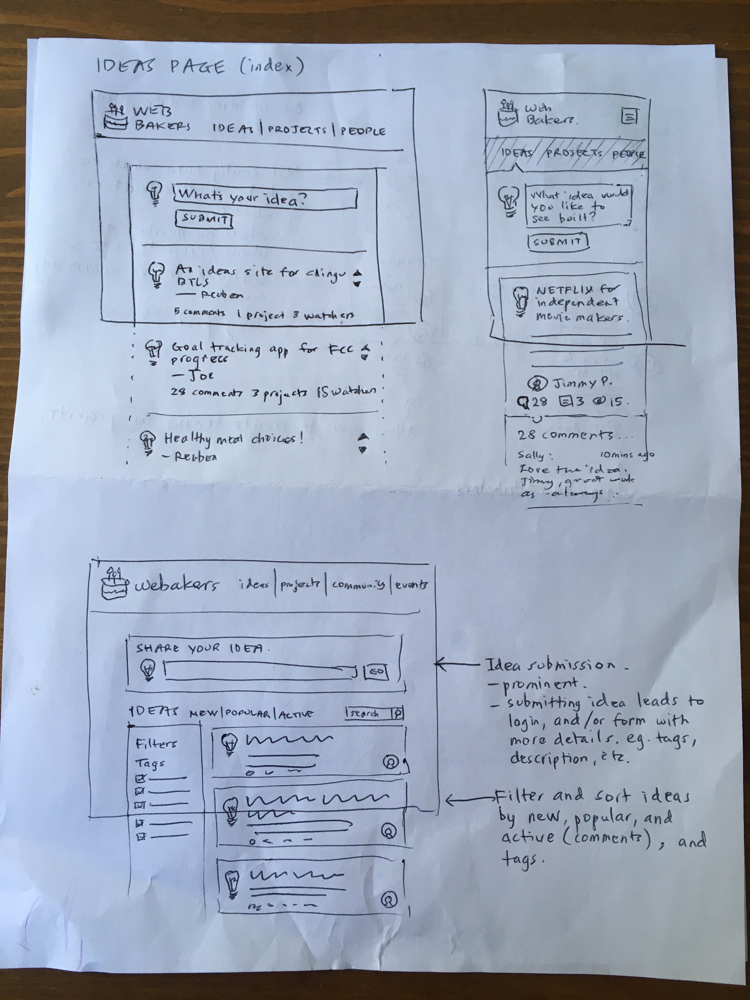
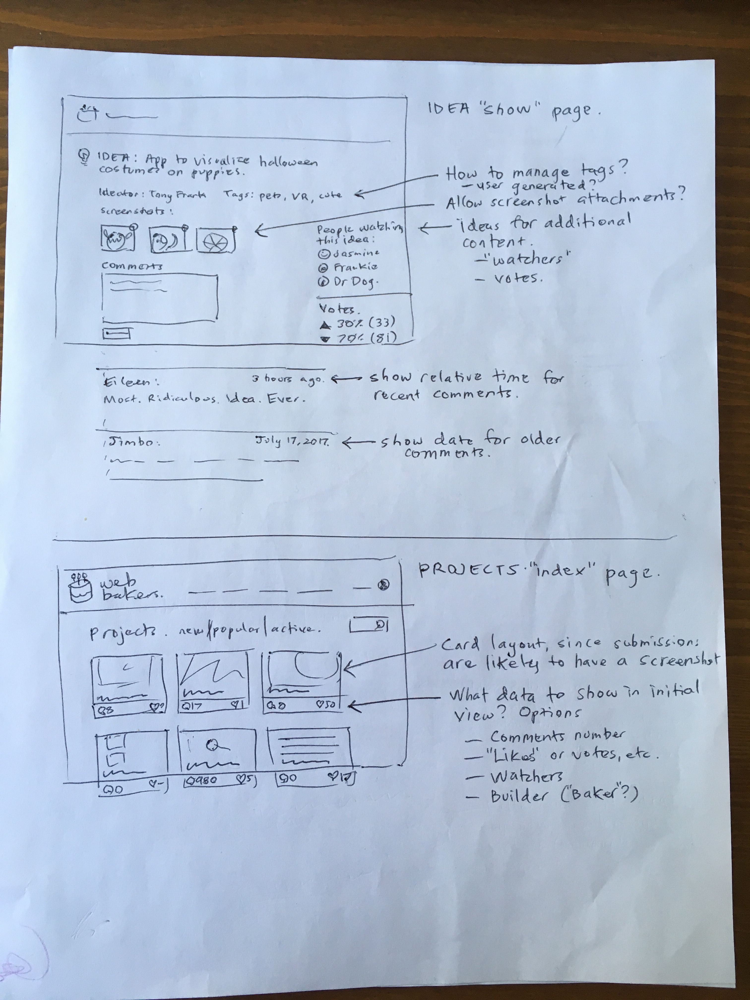

# Web Bakers

<h4>Web Bakers is an ideas kitchen that connects great project ideas with people who can make them happen.<h4>

# Table of Contents
1. [Elevator Pitch](#elevator-pitch)
2. [Brief](#brief)
3. [Technologies Used](#technologies-used)
4. [Wireframes](#wireframes)
5. [Pageflow Diagrams](#pageflow-diagrams)
6. [User Stories and Test Plan](#user-stories-and-test-plan)
7. [Contributors](#contributors)
8. [License](#license)

## Elevator Pitch

<b>A platform for your programming project ideas - at every stage of the build process.</b>

Web Bakers is an ideas kitchen in a sharing economy. Contribute your vision, discuss common challenges, and collaborate with other developers and designers on the projects that inspire you. Share your successes and see how other developers approached the same problem.  Struggling with your own great idea? <a href="http://www.jamesaltucher.com/2014/05/the-ultimate-guide-for-becoming-an-idea-machine/">Exercise your idea muscle.</a>

## Brief

<b>The goals of this project are as follows:</b>
    <ul>
        <li> Provide a collaborative and creative outlet for developers, designers and other ideators via a responsive web app.</li>
        <li>Create a working MVP with a UI that is clean, simple and easy to navigate.</li>
        <li>Ensure the success of our goals and ease of future additions by following collaboration best practices.</li>
    </ul>

We are targeting developers, designers, and other creative types (collectively referred to as <em>ideators</em>) that have a vision for new projects and application ideas.  

Our ideator audience includes teens and adults of any socioeconomic class, age, race, ability level and skill level who have access to a mobile device or computer.  Although our core developer team is based in North America, geographic location for our users is unlimited, and we encourage international participation.

Web Bakers ideators will be able to access the app through our website on a computer, smartphone, or tablet.  At this time, we do not anticipate creating a version for download as a mobile app.  We hope to achieve a clean, modern, look and feel.  Functionality and ease of use are the main UI goals.  We are inspired to design a user-friendly interface for communicating ideas that is similar in feel and function to reddit.

## Technologies Used

For this project, we are using the MEN stack. 

1. Javascript
2. Express
3. Node
4. MongoDB

Currently, we are running the app locally, but have a stretch goal of deployment on Heroku coming soon!

## Wireframes

Below are examples of wireframes from the initial design stage of our project.

## Pageflow Diagrams

    Coming soon!

## User Stories and Test Plan

### We will use manual testing to verify our scenarios and document the results alongside each user story:

| As an ideator, I can... | Goal Level | Status |
| --- | --- | --- |
| Create a personal account | MVP | Passing :white_check_mark: |
| Login and logout of my account | MVP | Passing :white_check_mark: |
| View a list of submitted ideas from the landing page, whether or not I am logged in | MVP | Passing :white_check_mark:
| Submit a project idea and see it listed on the landing page | MVP | Passing :white_check_mark: |
| View more details about an idea by clicking on it from the landing page | MVP | Passing :white_check_mark: |
| "Like" an idea | Stretch Goal | Not Passing :red_circle: |
| "Watch" an idea - see a list of all ideas I am watching on my account profile page | Stretch Goal | Not Passing :red_circle: |
| Edit ideas I have previously posted via the idea detail page | Stretch Goal | Not Passing :red_circle: |
| Delete an idea I have previously posted via the idea detail page | Stretch Goal | Not Passing :red_circle: |
| Add screenshots or photos to my own idea descriptions | Stretch Goal | Not Passing :red_circle: |
| Comment on an idea | Stretch Goal | Not Passing :red_circle: |
| Submit a finished project, based on a Web Bakers idea | Stretch Goal | Not Passing :red_circle: |
| Comment on another users finished project | Stretch Goal | Not Passing :red_circle: |
| Contact the ideator of a project, so that I can confirm requirements, better understand the problem, or suggest improvements | Stretch Goal | Not Passing :red_circle: |
| Login to Web Bakers using Github | Stretch Goal | Not Passing :red_circle: |
| View my account profile, including information about ideas and finished projects I have submitted to Web Bakers, as well as projects I am watching | Stretch Goal | Not Passing :red_circle: |
| Sort ideas alphabetically and by time submitted | Stretch Goal | Not Passing :red_circle:|
| Sort ideas by Popularity (number of likes) or Activity (number of comments) | Stretch Goal | Not Passing :red_circle: | 
| Add tags to my ideas or finished projects, so that other users can find my content | Stretch Goal | Not Passing :red_circle: |
| Filter posted ideas by subject tags | Stretch Goal | Not Passing :red_circle: |
| Reset my password | Stretch Goal | Not Passing :red_circle: |

Future testing goals include implementing unit and acceptance tests using the mocha.js and chai.js frameworks.

## Contributors

The Web Bakers team is made up of Reuben Jones, Joe Previte and Rachel Wilson, also affectionately known as the Future Coding Wizards. This project began as a team challenge during July 2017, as part of the [Chingu Developer Network's](https://chingu-cohorts.github.io/chingu-directory/) cohort called Voyage-1.  We continue to build on it for fun and hope you like it too.

## License

Licensed under GPL.

Copyright :copyright: 2017 Reuben Jones, Joe Previte, Rachel Wilson

Last Updated: 11/28/2017